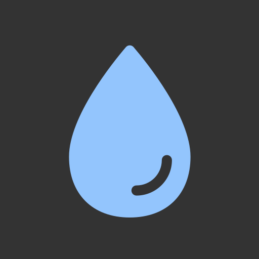

<!-- Improved compatibility of back to top link: See: https://github.com/othneildrew/Best-README-Template/pull/73 -->
<a name="readme-top"></a>
<!--
*** Thanks for checking out the Best-README-Template. If you have a suggestion
*** that would make this better, please fork the repo and create a pull request
*** or simply open an issue with the tag "enhancement".
*** Don't forget to give the project a star!
*** Thanks again! Now go create something AMAZING! :D
-->

<!-- PROJECT LOGO -->
<br />
<div align="center">
  <a href="https://github.com/CastillejaCode/water-schedule">
    
  </a>

<h3 align="center">Hydration</h3>

  <p align="center">
   A watering schedule for your plants.
    <br/>
  Keeps track of when you need to water your plants based on provided schedules.
    <br/>
  Uses a monthly calendar to easily keep tabs on when your babies need some hydration. 
    <br />
    <br />
    <a href="https://water-schedule.pages.dev">View Demo</a>
    ·
    <a href="https://github.com/CastillejaCode/water-schedule/issues">Report Bug</a>
    ·
    <a href="https://github.com/CastillejaCode/water-schedule/issues">Request Feature</a>
  </p>
</div>

<!-- ABOUT THE PROJECT -->
## About The Project
Desktop              |  Mobile 
-------------------------|-------------------------
  |  

### Built With

<a href="https://www.typescriptlang.org/">  

</a>
<br/>
<a href="https://react.dev/">  

</a>
<br/>
<a href="https://tailwindcss.com/">  

</a>
<br/>
<a href="https://expressjs.com/">  

</a>
<br/>
<a href="https://www.postgresql.org/">  

</a>
<br/>


### How It's Made

I needed a simple way to track when to water my native plants since I kept forgetting, so I made this. 

For the backend, I sticked with the trustworthy Express.  
For my database, I went with PostGreSQL instead of MongoDB, since I thought a relational database would fit my needs better, and I wanted to learn SQL.
Because of that, I just went with using raw SQL queries instead of abstracting it away via Object Relational Mapping 
I also implemented testing for the backend with a test databse to ensure my queries and REST calls were doing the right thing.  

For the frontend, I went with React to hone the skills ever more. 
As the need for global state management eventually came, I opted for Zustand instead of Redux w/ RTK. Much simpler to use. 
For data fetching and caching, I opted for Tanstack Query instead of RTK Query. They both seem to be similar in performance. While RTK seems a bit more flexible, Tanstack Query was much simpler to use and got the job done the same, so I will most likely use this for future projects. 
I also wanted to use navigable pages, so I added React Router for routing purposes.

Due to the larger scope of the project, I drew inspiration from [Bulletproof React](https://github.com/alan2207/bulletproof-react) for restructuring my frontend file structure. 
In essence, I broke down specific portions of the project into different features, where one could find all the relevant components, libs, utils, etc.

I also wanted to focus on creating a more streamlined deployment process, so I created a CI/CD pipeline using Github Actions. 
My pipeline tests, lints, and deploys either the client or the server based on detected changes. Tags are automatically created for easier bug tracking. 

In essence the client and server are two projects that can be run independently, and are lumped together for ease of development.

### Optimizations

Initially I had formulated the API so that one POST request would amrk one plant as watered. 
But when I added a feature to water all the plants on one day at the same time, I initially just made a loop working on each plant. So I was making many singular POST requests in succession... 
So I refactored the backend to accept an array of dates to add to the database, only now needing one request. 

I refactored the code to remove extraneous usage of global state management. The usage of routing allowed me to move away from this reliance I had done in an earlier project.
I narrowed it down to just communicating the calendar date to all other components, and a toast notification whenever a query is completed. 

The use of Tanstack Query, which includes caching, helps with saving data when the same data has been seen before.

In the future, I will move the static assets to a CDN for smaller bundle sizes.

### Learning Outcomes

| The Good                               | The Bad                                              | The Ugly |
|----------------------------------------|------------------------------------------------------|----------|
| Used a more organized file structure for easier navigation and scalability    | I should have designed the website from the beginning, designing while developing wastes time and leads to less coherent designs ||
| Utilzed routing for easier UX and DX | Took a while to figure out user authorization and protected routes||
| Learnt to deploy the frontend and backend separately and to different providers| ||
| Created a CI/CD pipeline for easier deployment and lowering the possibility of bugs being pushed into prod|||
| Tried out new technologies that lead to a better DX, making future projects more efficient and more enjoyable to work with | |
| SQL is great, I will probably stick with relational databses from now on |||
| It is very satisfying creating a project that I will use in my daily life |||

<!-- GETTING STARTED -->
## Getting Started


### Prerequisites

* pnpm
  ```
  npm install -g pnpm
  ```

### Installation

1. Clone the repo
   ```
   git clone https://github.com/CastillejaCode/portfolio.git
   ```
2. Install NPM packages
   ```
   pnpm install 
   ```
3. Run local development server
   ```
   pnpm dev
   ```
 4. Switch out my info for yours

    For projects, you can just replace the array with your project objects, and they will be automatically created


<!-- LICENSE -->
## License

Distributed under the MIT License. See `LICENSE.txt` for more information.

<!-- CONTACT -->
## Contact

Julian Krzysiak - jkrzysiak13@gmail.com

<!-- ACKNOWLEDGMENTS -->
## Acknowledgments

* Favicon generator - [favicon.io](https://favicon.io/)
* Icons - [Hero Icons](https://heroicons.com/)
* Readme Template - [Best-README-Template](https://github.com/othneildrew/Best-README-Template)

<p align="right">(<a href="#readme-top">back to top</a>)</p>


